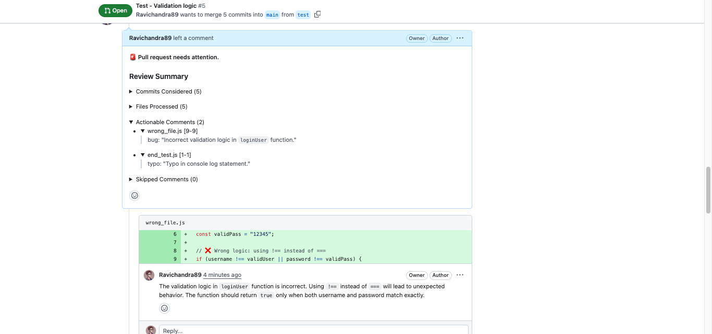
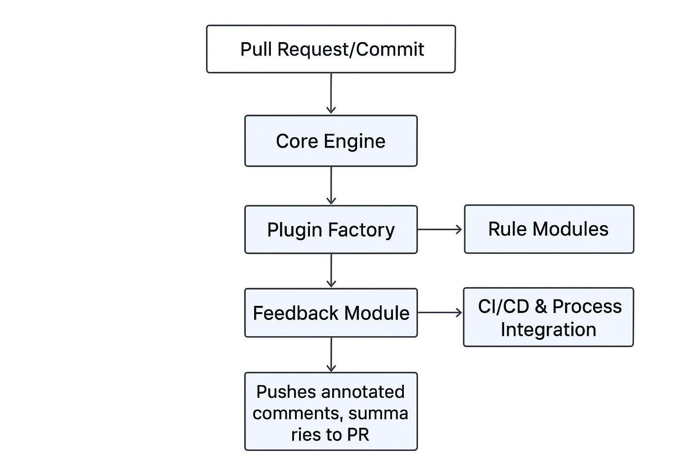

# 📖 Description

**Merge-Shield** adds intelligent pre-submission checks to improve software quality.  
It automates code analysis, enforces standards, and ensures every PR meets quality gates before merging.

### 🔹 Key Capabilities

- Automated code analysis & style validation
- Configurable, extensible rules engine
- Pre-submission workflows for commits & PRs
- Pluggable integrations (linters, security, formatters)
- Boosts developer productivity by catching issues early

## 🔹 See it in Action

Automated analysis the code of PR - request and showing the validation error below in image:

<!-- Put the image here  -->


## 🔹 Architecture Overview

The architecture of Merge-Shield mirrors the clean, modular, and extensible structure evident in Presubmit.ai’s implementation. Here's the breakdown:

### 1. Core Engine

- The heart of the system that orchestrates pre-submission validation workflows.
- Listens to incoming pull requests or commits, and triggers associated analysis processes.

### 2. Rules & Validation Modules

- Contains individual rule modules for static checks like linting, bug detection, security analysis, or summarization.
- Each rule runs independently and returns structured feedback, enabling granular checks.

### 3. Integration Layer

- A dynamic loader that instantiates rule processors and integrations—such as different LLM providers (OpenAI, Anthropic, Gemini), linters, or scanners.
- Keeps the core engine agnostic to specific implementations.

### 4. Event & Observer System

- Follows the **Observer Pattern** to notify subscribers (e.g., CI/CD pipeline, GitHub Actions, Slack bot) whenever a rule passes or fails.
- Provides real-time feedback to developers during the submission process.

### 5. Summarization Module & Feedback

- Aggregates results from rule modules.
- Generates comprehensive summaries, annotated comments, and suggested fixes directly within PRs.

### 6. Extensibility

- Supports custom rules via configuration files.
- Allows third-party developers to add plugins without modifying the system’s internals.

## 7. CI/CD & Process Integration

- Seamlessly integrates with GitHub Actions, CI pipelines, or other VCS workflows.
- Commits must pass Merge-Shield validations before merging, similar to how Presubmit.ai gates pull requests .

---
<!-- Attach image here -->


This layered design ensures that Merge-Shield remains flexible, maintainable, and scalable—just like Presubmit.ai. It empowers teams to plug in their own code validators, enable interpretable feedback, and evolve the system without breaking the core.

## 🔹 Usage

### Step 1: Add LLM_API_KEY secret

    1. Go to your repository's Settings > Secrets and Variables > Actions.
    2. Click "New Secrets"
    3. Add a new secret with:
        - Name: LLM_API_KEY
        - Value: Put your original API Key from one of these providers:
            - OpenAI API
            - Google AI Studio (Gemini)

### Step 2: Create GitHub WorkFlow

    Add this Github Action to your repository by creating .github/workflows/merge-shield.yml:
    ```bash
    name: Merge-Shield

    permissions:
        contents: read
        pull-requests: write
        issues: write

    on:
        pull_request_target:
        types: [opened, synchronize]
        pull_request_review_comment:
        types: [created]

    jobs:
        review:
            runs-on: ubuntu-latest
            steps: 
                - name: Check required secrets
                  run: |
                    if [ -z "${{ secrets. LLM_API_KEY }}" ]; then
                      echo "Error: LLM_API_KEY secret is not configured"
                      exit 1
                    fi 
                - uses: Ravichandra89/merge-shield@main
                env:
                   GITHUB_TOKEN: ${{ secrets.GITHUB_TOKEN }}
                   LLM_API_KEY: ${{ secrets.LLM_API_KEY }}
                   LLM_MODEL: "claude-3-5-sonnet-20241022"
    ```
    The Action Requires: 
        - Github Token: Automatically Provided by GitHub Actions
        - LLM_API_KEY: Your API Key
        - LLM_MODEL: Define which LLM model to use. Make sure model is supported and matches the LLM_API_KEY.

<!-- Merge-Shield Feature Section -->

## 🔹 Features  

### 🚀 Smart Reviews  
- Automatically analyzes pull requests before merging.  
- Highlights style violations, security risks, and best-practice issues.  
- Reduces manual review effort by catching common mistakes early.  

### 🔒 Security & Quality  
- Detects vulnerable dependencies and unsafe coding patterns.  
- Enforces quality gates to ensure code meets organizational standards.  
- Integrates with static analysis and security scanners for robust protection.  

### ⚙️ Configurable  
- Flexible `.mergeshield.json` file for defining custom rules.  
- Supports enabling/disabling rules per project or per branch.  
- Allows teams to extend functionality with custom plugins.  

### 🔗 Seamless Integration  
- Works with GitHub, GitLab, Bitbucket, and other version control platforms.  
- Integrates into CI/CD pipelines with minimal setup.  
- Provides developer feedback via CLI, pull request comments, or chat tools (e.g., Slack).  


## 🔹 Installation  

Follow these steps to set up **Merge-Shield** locally:  

### 1. Clone the Repository  
```bash
git clone https://github.com/your-username/merge-shield.git
cd merge-shield
```

### 2. Install Dependencies
Make sure you have Node.js (>=16) and npm installed. Then run:
```bash
npm install
```

### 3. Build the Project
```bash
npm run build
```
### 4. Run merge-shield
start the CLI tool locally: 
```bash
npm run dev


---

⚡ Would you like me to also add a **“Quick Start with GitHub Actions”** under Installation so users can immediately use Merge-Shield in their CI/CD without local setup?
```

<!-- Tech stack -->


## 🔹 Tech Stack for Presubmit with Vitest

### 1. Version Control & CI/CD
- **Git**: Distributed version control system for source code management.
- **GitHub/GitLab/Bitbucket**: Platforms hosting repositories and facilitating collaboration.
- **CI/CD Tools**:
  - **GitHub Actions**: Automates workflows, including presubmit checks.
  - **GitLab CI**: Provides CI/CD pipelines integrated with GitLab repositories.

### 2. Testing Framework
- **Vitest**: A fast and lightweight testing framework built on Vite, designed for modern JavaScript and TypeScript projects.
  - First-class ES module support
  - Unit test, Integration test and End-2-End test.
  - Instant test execution
  - Jest-compatible API
  - Test filtering and concurrent test execution

### 3. Code Quality & Linting
- **ESLint**: Static code analysis tool for identifying problematic patterns in JavaScript/TypeScript code.
- **Prettier**: Code formatter that ensures consistent code style.
- **Lint-staged**: Runs linters on pre-committed files to ensure code quality before commit.

### 4. Type Checking
- **TypeScript**: Superset of JavaScript that adds static typing.
- **Type Checking Tools**:
  - **TypeScript Compiler (`tsc`)**: Checks for type errors.
  - **ESLint with TypeScript Plugin**: Integrates TypeScript type checking into ESLint.

### 5. Pre-Submit Hooks
- **Husky**: Manages Git hooks to enforce presubmit checks.
- **Lint-staged**: Ensures that only staged files are linted and formatted.
- **Prettier**: Formats code before commit to maintain consistent style.

### 6. Development Tools
- **VS Code**: Popular code editor with extensions for linting, formatting, and testing.
- **Vitest VS Code Extension**: Provides test running and debugging capabilities within the editor.
- **ESLint and Prettier Extensions**: Integrate linting and formatting directly into the editor.

---

## 🔧 Example Workflow

1. **Developer Workflow**:
   - Developer writes code and commits changes.
   - Husky pre-commit hook triggers linting and formatting via lint-staged and Prettier.
   - If linting or formatting fails, commit is aborted.

2. **CI/CD Pipeline**:
   - On push to the repository, CI/CD pipeline is triggered.
   - Pipeline installs dependencies and runs tests using Vitest.
   - If tests pass, code is deployed; if tests fail, deployment is halted.

3. **merge-shield Checks**:
   - Before merging pull requests, merge-shield checks ensure code quality and test coverage.
   - Checks include linting, formatting, type checking, and test execution.
   - Only code that passes all checks is merged into the main branch.


## 🔹 Your Support! ⭐
If you find merge-shield helpful in improving your workflow and helping others discover it:  
- 🌟 Star this repository  
- 🙌 Share it with your friends and colleagues  
- 💬 Give feedback or open issues to help us improve
